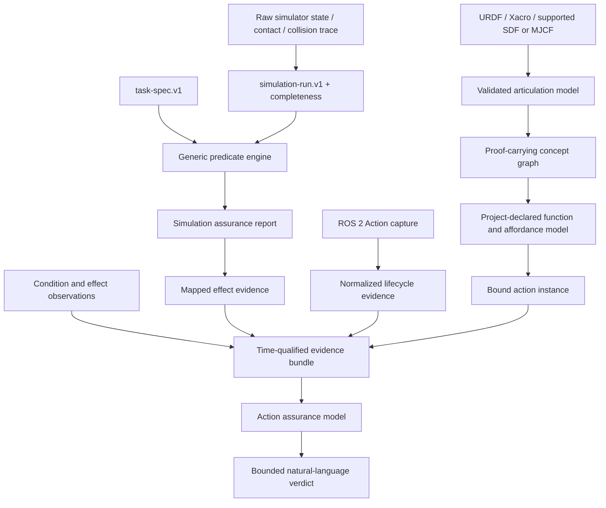

# Robot Spatial Understanding

An evidence-grounded Codex Skill for understanding robot descriptions and judging simulated or ROS 2 action results without confusing declarations, protocol reports, observations, and physical truth.

這是一個讓 Codex／AI 能以可驗證方式理解 URDF 與機器人空間結構的 Skill。它也能判讀一次模擬或 ROS 2 Action 的執行結果，同時保留「已知、未知、宣告、觀察與推論」之間的界線。

## What is usable now

The project now has two connected products:

1. the original deterministic robot-description and ROS evidence toolchain;
2. an installable simulation-evidence SDK/CLI that derives task predicates directly from raw
   joint, pose, odometry, contact, collision, force, and partial deformable-state streams.

The simulation path does **not** accept benchmark reward or success labels as prediction input.
It produces `supported`, `refuted`, `unknown`, or `conflicting` results with sample indices,
thresholds, source digests, and explicit non-guarantees.

Install the developer package:

```bash
python3 -m venv .venv
.venv/bin/python -m pip install -e .
.venv/bin/robot-spatial --version
```

Run the included PickCube-shaped state example:

```bash
robot-spatial import --adapter maniskill \
  examples/pickcube/trace.json \
  --out work/pickcube-run

robot-spatial evaluate work/pickcube-run \
  --task examples/pickcube/task.yaml \
  --out work/pickcube-result

robot-spatial explain work/pickcube-result/report.json \
  --out work/pickcube-result/report.md
```

The committed example is synthetic and tests the public adapter contract; it is not presented as
an upstream ManiSkill benchmark result. Real benchmark evidence requires pinned simulator/assets,
seeds, raw state capture, and an isolated official reference result.

Run a live ManiSkill PickCube replay from an action-only HDF5 trajectory:

```bash
python -m pip install -e '.[maniskill,dev]'
robot-spatial capture --adapter maniskill \
  --env-id PickCube-v1 --seed 2 --trajectory actions.h5 \
  --entity-map examples/pickcube-live/pickcube-entities.yaml \
  --sim-backend physx_cpu --fixed-horizon 100 \
  --out work/pickcube-live/run
robot-spatial evaluate work/pickcube-live/run \
  --task examples/pickcube-live/task.yaml \
  --out work/pickcube-live/result
```

The live path reads mapped robot qpos/qvel, declared actor/computed-frame poses, optional rigid-body
velocities and episode geometry, declared pairwise contact forces, and CPU scene collision pairs
directly from `env.unwrapped`. Entity-map v2 selects the ManiSkill robot and resolves public source
paths without task-specific adapter code. It opens only `traj_N/actions` in the
trajectory archive, discards every `step()` return, and never reads reward, success, `info`, or
`evaluate()` during prediction. GPU capture retains pairwise contact evidence and marks complete
collision enumeration unavailable.

The [100-case PickCube record](benchmarks/records/maniskill-pickcube-v1-100.json) has 100/100
episode agreement with the isolated official evaluator and 100% confirmed-success precision at a
fixed 100-step horizon. All 50 official-planner cases are supported. Of the 50 no-op controls, 49
are refuted and seed 8 is correctly supported because its cube starts inside the official goal
tolerance. The resulting 51 supported and 49 refuted references satisfy the declared coverage
gate without changing the official evaluator or using outcome-dependent termination.
The [16-environment CUDA smoke record](benchmarks/records/maniskill-pickcube-v1-cuda-smoke.json)
separately verifies one digest-bound run per sub-environment and `unknown` collision diagnostics
when complete GPU collision enumeration is unavailable.

The cross-task/cross-robot [ManiSkill manipulation matrix](benchmarks/records/maniskill-manipulation-matrix.json)
adds Panda/PandaWristCam PushCube, StackCube, and PegInsertionSide plus xArm6 PickCube. Its 16 sealed
solver/no-op episodes contain 7 supported and 9 refuted official references with 16/16 episode and
28/28 scored-predicate agreement. Each profile independently contains both labels. The complete
162-file run repeats byte-for-byte in the [determinism record](benchmarks/records/maniskill-manipulation-determinism.json),
the cross-profile [corruption matrix](benchmarks/records/maniskill-manipulation-corruption.json)
passes 21/21, and the prediction-first [CUDA replay gate](benchmarks/records/maniskill-manipulation-cuda-smoke.json)
passes 4/4. These are enumerated simulation profiles, not evidence of unrestricted robot/task or
hardware generalization.

The xArm profile requires ManiSkill's official `xarm6_robotiq` asset (download with
`python -m mani_skill.utils.download_asset xarm6_robotiq -y`). The record binds its robot-model,
task-source, entity-map, task-spec, initial-state, action, run, report, and reference digests.

```bash
PYTHONPATH=scripts python benchmarks/maniskill_manipulation_evidence.py \
  --out work/maniskill-manipulation --seeds 0 4
PYTHONPATH=scripts python benchmarks/maniskill_manipulation_corruption.py \
  --benchmark-root work/maniskill-manipulation --out work/maniskill-corruption
PYTHONPATH=scripts:benchmarks python benchmarks/maniskill_manipulation_cuda_smoke.py \
  --cpu-benchmark-root work/maniskill-manipulation --out work/maniskill-cuda
```

Run a real MuJoCo episode with the optional Gymnasium Robotics adapter:

```bash
python -m pip install -e '.[mujoco]'
robot-spatial capture --adapter gymnasium-robotics \
  --env-id FetchReach-v3 --seed 2 --max-steps 50 \
  --out work/fetch-reach-run
robot-spatial evaluate work/fetch-reach-run \
  --task examples/fetch-reach/task.yaml \
  --out work/fetch-reach-result
```

`benchmarks/gymnasium_fetch_reach_smoke.py` is the reproducible oracle-isolation check. It first
captures and evaluates seeds 2 and 7 without retaining reward or `info["is_success"]`, then starts
separate same-seed official replays. The committed record contains one supported and one refuted
case, both agreeing with the isolated official result. This is live simulator smoke evidence, not
a statistical benchmark. See the exact [smoke record](benchmarks/records/gymnasium-fetchreach-v3-smoke.json).

### Developer inputs

For simulator-result evaluation, provide:

- a robot/world identity and asset/model digests;
- an immutable `robot-spatial-generic-trace.v1` export, or a supported adapter export;
- a declarative `robot-spatial-task-spec.v1` defining entities, predicates, thresholds, time
  windows, goal, and failure conditions;
- optionally, a simulation-action map that binds derived predicates to an existing functional
  model's `effect/` declarations;
- for benchmark scoring, a separate reference-result artifact that is not visible during
  prediction.

## Why this exists

URDF is excellent for declaring links, joints, frames, geometry, inertials, and limits. It is not, by itself, a semantic explanation of:

- how the mechanism is composed;
- which joint causes which downstream motion;
- what a component is intended to do;
- whether an action was ready at a particular time;
- what an action server reported;
- whether the declared effect was actually observed;
- whether a later observation was caused by that action.

This project compiles robot sources and runtime evidence into digest-bound, queryable artifacts. Codex can then answer questions from those artifacts instead of guessing from joint names, mesh appearance, a single pose, or a `SUCCEEDED` status.

## Core idea



The layers intentionally remain separate:

| Layer | What it can establish | What it cannot establish alone |
| --- | --- | --- |
| Robot description | represented structure, frames, joint laws, declared geometry | component purpose or current world state |
| Function model | project-declared function, capability, conditions, intended effects | runtime truth or physical executability |
| ROS Action capture | goal response, status, feedback, result reports for one goal UUID | physical motion, effect, causation, or safety |
| Effect evidence | an effect predicate was observed at a declared time | that the action caused the observation |
| Simulation run | normalized samples, completeness, entity identities, and source digests | official task outcome, hardware truth, or omitted state |
| Predicate engine | declared state/temporal predicates over the bound run | universal semantics, task success outside the task spec, or real-world causation |
| Action assurance | evidence-qualified readiness, lifecycle, effects, discrepancies, unknowns | safety certification or real-world truth beyond supplied evidence |

## What the Skill can do

- Resolve ROS workspaces and expand Xacro before parsing URDF.
- Validate tree structure, joint types, limits, mimic relations, frames, inertials, geometry, and semantic annotations.
- Export deterministic forward kinematics, transforms, axes, Jacobians, sampled workspace, gravity loads, collision candidates, and semantic render/motion atlases.
- Compile a pose-independent articulation grammar for URDF and supported SDF/MJCF subsets.
- Produce proof-carrying structural concepts such as roots, unique paths, branches, serial segments, descendants, and joint causality.
- Bind explicit project declarations for component function, capabilities, preconditions, intended effects, and affordances.
- Normalize ROS 2 `/joint_states`, `/tf`, `/tf_static`, and Action client captures with exact clocks, identities, times, and file digests.
- Judge one action's readiness, protocol lifecycle, observed effects, inconsistencies, and unresolved evidence boundaries.
- Normalize immutable ManiSkill/SAPIEN, MuJoCo, Gazebo/ROS 2, generic JSON, and partial deformable-state exports without importing their success labels.
- Capture fixed-horizon ManiSkill/SAPIEN state and contacts live from action-only trajectories, with one digest-bound run per sub-environment.
- Capture three-dimensional Gymnasium Robotics GoalEnv pose episodes directly from MuJoCo while discarding reward and official success output.
- Evaluate AGV goal/corridor, arm pose/joint, rigid-body static, sampled collision-free, sustained
  or terminal directional contact, lift, follow, grasp, release, world/reference-local region, and
  insertion predicates, including digest-bound per-episode geometry thresholds.
- Detect missing, stale, gapped, out-of-order, conflicting, identity-corrupted, and digest-tampered evidence.
- Score predictions against separately loaded benchmark references with confusion matrices, F1, confirmed-success precision/FPR, and 95% Wilson intervals.
- Compare matched action/no-op replays for simulation-bounded contribution evidence without calling it real-world causation.
- Verify important generated artifacts by exact deterministic regeneration.
- Guard supported URDF edits with project-owned invariants and independent evaluation tools.

Read [SKILL.md](SKILL.md) for the complete Codex workflow and [references/](references/) for the artifact contracts.
New users should start with the [developer quickstart](docs/developer-quickstart.md). The
[delivery status](ROADMAP.md) distinguishes implemented code from external suites that remain to
be run.

The new contracts are documented in
[simulation-evidence-contract.md](references/simulation-evidence-contract.md) and
[simulator-adapter-contract.md](references/simulator-adapter-contract.md). Reviewable JSON Schema
drafts live in [schemas/](schemas/). The planned public
benchmark counts and execution cadence are machine-readable in
[benchmarks/release-matrix.yaml](benchmarks/release-matrix.yaml); registry presence is not a claim
that those external suites have already been executed.

## Judge an execution result

For an existing simulation or ROS 2 Action capture, the default flow is offline and does not dispatch a goal:

```bash
python3 scripts/ros_action_adapter.py normalize functional-model.json \
  --config action-adapter-config.json \
  --capture action-capture.json \
  --evidence-source evidence/ros-action.json \
  --supplemental-source evidence/conditions-effects.json \
  --bundle action-evidence-bundle.json \
  --report action-normalization-report.json

python3 scripts/robot_spatial.py action-assurance \
  functional-model.json action-evidence-bundle.json \
  --out action-assurance.json

python3 scripts/robot_spatial.py verify-action-assurance \
  functional-model.json action-evidence-bundle.json \
  --model action-assurance.json \
  --out action-assurance-verification.json
```

Create a summary query:

```json
{
  "schema_version": "robot-spatial-action-assurance-query.v1",
  "query_id": "question/run-summary",
  "intent": "summarize_action",
  "parameters": {}
}
```

Then query the verified model:

```bash
python3 scripts/robot_spatial.py query-action-assurance \
  action-assurance.json action-summary-query.json \
  --out action-summary-answer.json
```

The resulting verdict keeps these conclusions separate:

- preconditions were supported at `decision_time`;
- the goal was accepted or rejected;
- the latest reported status was executing, succeeded, aborted, or canceled;
- the terminal result agreed or disagreed with status;
- each declared effect was true, false, unknown, stale, missing, or conflicting;
- the effect was observed before or after execution began;
- physical success, causal success, authorization, and safety remain established or unestablished.

If only lifecycle evidence is supplied, the Skill can judge the protocol exchange but will correctly leave physical effects unknown.

## Installation as a Codex Skill

Clone directly into the personal Skills directory:

```bash
mkdir -p ~/.codex/skills
git clone https://github.com/jerry102102102/Robot-Spatial-Understanding.git \
  ~/.codex/skills/understand-robot-spatial
```

Start a new Codex task and invoke:

```text
Use $understand-robot-spatial to inspect this URDF and explain its structure.
```

Or:

```text
Use $understand-robot-spatial to judge this simulated action capture. Separate
protocol success, observed effects, physical success, causation, and safety.
```

## Basic model workflow

Validate a URDF:

```bash
python3 scripts/robot_spatial.py validate robot.urdf
```

Export an AI-readable context:

```bash
python3 scripts/robot_spatial.py export robot.urdf \
  --workspace-samples 0 \
  --out work/robot-context
```

Useful deterministic queries include:

```bash
python3 scripts/robot_spatial.py tree robot.urdf
python3 scripts/robot_spatial.py chain robot.urdf --from base_link --to tool0
python3 scripts/robot_spatial.py affects robot.urdf --joint wrist_joint
python3 scripts/robot_spatial.py transform robot.urdf \
  --pose pose.json --from base_link --to tool0
```

For project-declared function and affordance reasoning, compile a functional model with `--functional-spec` and use `query-functions`. See [references/function-affordance-contract.md](references/function-affordance-contract.md).

## ROS 2 capture boundary

`ros_action_adapter.py normalize` is dependency-light and works offline. Live `execute-capture` additionally requires a ROS 2 Python environment with:

- `rclpy`;
- `action_msgs`;
- `rosidl_runtime_py`;
- `unique_identifier_msgs`;
- the requested action interface package.

Probe the current environment:

```bash
python3 scripts/ros_action_adapter.py probe
```

`execute-capture` can dispatch a real goal and may move hardware. It therefore requires `--authorize-dispatch` to exactly equal the configured action instance ID. This is only an explicit CLI dispatch gate; it is not a safety or organizational authorization system. Offline analysis should be preferred for supplied simulation captures.

## Evidence rules that must not be collapsed

- `ready_under_declared_model_and_evidence` does not mean safe or authorized to run.
- Goal acceptance does not mean the action completed.
- `result_succeeded` is an action-server report, not proof of physical success.
- Feedback and result payloads are audit data, not effect evidence.
- A later effect observation does not prove the action caused it.
- Consistent clock labels do not prove clock synchronization.
- Producer identity does not prove producer truthfulness.
- Missing evidence is unknown, not automatically false.
- Simulation evidence applies only to the declared simulator, model, clock, sensors, and interval; it is not real-hardware evidence.

The detailed contracts are in:

- [ROS Action adapter contract](references/ros-action-adapter-contract.md)
- [Action assurance contract](references/action-assurance-contract.md)
- [Functional model contract](references/function-affordance-contract.md)
- [Concept language contract](references/concept-language-contract.md)
- [Spatial model contract](references/spatial-contract.md)

## Verification

Run the complete unit suite:

```bash
python3 -m unittest discover -s scripts/tests -p 'test_*.py'
```

Run the independent action oracles:

```bash
python3 scripts/crosscheck_action_assurance.py \
  --cases 24 --seed 20260718 --out work/action-assurance-crosscheck.json

python3 scripts/crosscheck_ros_action_adapter.py \
  --out work/ros-action-crosscheck.json
```

The current source passed:

- 187 unit/integration tests (the frozen 166-test baseline plus 21 simulation-evidence tests);
- a live Gymnasium Robotics/MuJoCo `FetchReach-v3` smoke replay with one supported and one refuted seed, both agreeing with an isolated official replay and reproducing exact digests;
- 24 action-assurance cases with 240 independent assertions;
- 32 ROS Action normalization cases with 176 independent assertions;
- three raw-source forward evaluations, each scoring 44/44 without dispatching a goal.

These checks validate deterministic parsing, evidence accounting, query behavior, and exact regeneration for their covered cases. They do not certify hardware, controllers, sensors, clock synchronization, physical causation, or safety.

## Repository layout

```text
.
├── SKILL.md                 # Codex workflow and reasoning rules
├── agents/openai.yaml       # Skill UI metadata
├── scripts/                 # Compilers, adapters, queries, tests, and oracles
├── references/              # Versioned data and interpretation contracts
└── LICENSE                  # Apache License 2.0
```

## Scope

The main URDF path supports fixed, revolute, continuous, and prismatic tree joints, including mimic relations. Supplemental contracts cover explicitly declared coupling and closed-chain constraints, but finite numerical witnesses are not global configuration-space proofs.

The project is designed for grounded understanding and bounded execution-result interpretation. It is not a motion planner, controller, safety monitor, causal inference engine, or robot certification system.

## License

Apache License 2.0. See [LICENSE](LICENSE).
