# Robot Spatial Understanding

An evidence-grounded Codex Skill for understanding robot descriptions and judging simulated or ROS 2 action results without confusing declarations, protocol reports, observations, and physical truth.

這是一個讓 Codex／AI 能以可驗證方式理解 URDF 與機器人空間結構的 Skill。它也能判讀一次模擬或 ROS 2 Action 的執行結果，同時保留「已知、未知、宣告、觀察與推論」之間的界線。

## Why this exists

URDF is excellent for declaring links, joints, frames, geometry, inertials, and limits. It is not, by itself, a semantic explanation of:

- how the mechanism is composed;
- which joint causes which downstream motion;
- what a component is intended to do;
- whether an action was ready at a particular time;
- what an action server reported;
- whether the declared effect was actually observed;
- whether a later observation was caused by that action.

This project compiles robot sources and runtime evidence into digest-bound, queryable artifacts. Codex can then answer questions from those artifacts instead of guessing from joint names, mesh appearance, a single pose, or a `SUCCEEDED` status.

## Core idea

```mermaid
flowchart TD
    A["URDF / Xacro / supported SDF or MJCF"] --> B["Validated articulation model"]
    B --> C["Proof-carrying concept graph"]
    C --> D["Project-declared function and affordance model"]
    D --> E["Bound action instance"]
    F["ROS 2 Action capture"] --> G["Normalized lifecycle evidence"]
    H["Condition and effect observations"] --> I["Time-qualified evidence bundle"]
    G --> I
    E --> I
    I --> J["Action assurance model"]
    J --> K["Bounded natural-language verdict"]
```



The layers intentionally remain separate:

| Layer | What it can establish | What it cannot establish alone |
| --- | --- | --- |
| Robot description | represented structure, frames, joint laws, declared geometry | component purpose or current world state |
| Function model | project-declared function, capability, conditions, intended effects | runtime truth or physical executability |
| ROS Action capture | goal response, status, feedback, result reports for one goal UUID | physical motion, effect, causation, or safety |
| Effect evidence | an effect predicate was observed at a declared time | that the action caused the observation |
| Action assurance | evidence-qualified readiness, lifecycle, effects, discrepancies, unknowns | safety certification or real-world truth beyond supplied evidence |

## What the Skill can do

- Resolve ROS workspaces and expand Xacro before parsing URDF.
- Validate tree structure, joint types, limits, mimic relations, frames, inertials, geometry, and semantic annotations.
- Export deterministic forward kinematics, transforms, axes, Jacobians, sampled workspace, gravity loads, collision candidates, and semantic render/motion atlases.
- Compile a pose-independent articulation grammar for URDF and supported SDF/MJCF subsets.
- Produce proof-carrying structural concepts such as roots, unique paths, branches, serial segments, descendants, and joint causality.
- Bind explicit project declarations for component function, capabilities, preconditions, intended effects, and affordances.
- Normalize ROS 2 `/joint_states`, `/tf`, `/tf_static`, and Action client captures with exact clocks, identities, times, and file digests.
- Judge one action's readiness, protocol lifecycle, observed effects, inconsistencies, and unresolved evidence boundaries.
- Verify important generated artifacts by exact deterministic regeneration.
- Guard supported URDF edits with project-owned invariants and independent evaluation tools.

Read [SKILL.md](SKILL.md) for the complete Codex workflow and [references/](references/) for the artifact contracts.

## Judge an execution result

For an existing simulation or ROS 2 Action capture, the default flow is offline and does not dispatch a goal:

```bash
python3 scripts/ros_action_adapter.py normalize functional-model.json \
  --config action-adapter-config.json \
  --capture action-capture.json \
  --evidence-source evidence/ros-action.json \
  --supplemental-source evidence/conditions-effects.json \
  --bundle action-evidence-bundle.json \
  --report action-normalization-report.json

python3 scripts/robot_spatial.py action-assurance \
  functional-model.json action-evidence-bundle.json \
  --out action-assurance.json

python3 scripts/robot_spatial.py verify-action-assurance \
  functional-model.json action-evidence-bundle.json \
  --model action-assurance.json \
  --out action-assurance-verification.json
```

Create a summary query:

```json
{
  "schema_version": "robot-spatial-action-assurance-query.v1",
  "query_id": "question/run-summary",
  "intent": "summarize_action",
  "parameters": {}
}
```

Then query the verified model:

```bash
python3 scripts/robot_spatial.py query-action-assurance \
  action-assurance.json action-summary-query.json \
  --out action-summary-answer.json
```

The resulting verdict keeps these conclusions separate:

- preconditions were supported at `decision_time`;
- the goal was accepted or rejected;
- the latest reported status was executing, succeeded, aborted, or canceled;
- the terminal result agreed or disagreed with status;
- each declared effect was true, false, unknown, stale, missing, or conflicting;
- the effect was observed before or after execution began;
- physical success, causal success, authorization, and safety remain established or unestablished.

If only lifecycle evidence is supplied, the Skill can judge the protocol exchange but will correctly leave physical effects unknown.

## Installation as a Codex Skill

Clone directly into the personal Skills directory:

```bash
mkdir -p ~/.codex/skills
git clone https://github.com/jerry102102102/Robot-Spatial-Understanding.git \
  ~/.codex/skills/understand-robot-spatial
```

Start a new Codex task and invoke:

```text
Use $understand-robot-spatial to inspect this URDF and explain its structure.
```

Or:

```text
Use $understand-robot-spatial to judge this simulated action capture. Separate
protocol success, observed effects, physical success, causation, and safety.
```

## Basic model workflow

Validate a URDF:

```bash
python3 scripts/robot_spatial.py validate robot.urdf
```

Export an AI-readable context:

```bash
python3 scripts/robot_spatial.py export robot.urdf \
  --workspace-samples 0 \
  --out work/robot-context
```

Useful deterministic queries include:

```bash
python3 scripts/robot_spatial.py tree robot.urdf
python3 scripts/robot_spatial.py chain robot.urdf --from base_link --to tool0
python3 scripts/robot_spatial.py affects robot.urdf --joint wrist_joint
python3 scripts/robot_spatial.py transform robot.urdf \
  --pose pose.json --from base_link --to tool0
```

For project-declared function and affordance reasoning, compile a functional model with `--functional-spec` and use `query-functions`. See [references/function-affordance-contract.md](references/function-affordance-contract.md).

## ROS 2 capture boundary

`ros_action_adapter.py normalize` is dependency-light and works offline. Live `execute-capture` additionally requires a ROS 2 Python environment with:

- `rclpy`;
- `action_msgs`;
- `rosidl_runtime_py`;
- `unique_identifier_msgs`;
- the requested action interface package.

Probe the current environment:

```bash
python3 scripts/ros_action_adapter.py probe
```

`execute-capture` can dispatch a real goal and may move hardware. It therefore requires `--authorize-dispatch` to exactly equal the configured action instance ID. This is only an explicit CLI dispatch gate; it is not a safety or organizational authorization system. Offline analysis should be preferred for supplied simulation captures.

## Evidence rules that must not be collapsed

- `ready_under_declared_model_and_evidence` does not mean safe or authorized to run.
- Goal acceptance does not mean the action completed.
- `result_succeeded` is an action-server report, not proof of physical success.
- Feedback and result payloads are audit data, not effect evidence.
- A later effect observation does not prove the action caused it.
- Consistent clock labels do not prove clock synchronization.
- Producer identity does not prove producer truthfulness.
- Missing evidence is unknown, not automatically false.
- Simulation evidence applies only to the declared simulator, model, clock, sensors, and interval; it is not real-hardware evidence.

The detailed contracts are in:

- [ROS Action adapter contract](references/ros-action-adapter-contract.md)
- [Action assurance contract](references/action-assurance-contract.md)
- [Functional model contract](references/function-affordance-contract.md)
- [Concept language contract](references/concept-language-contract.md)
- [Spatial model contract](references/spatial-contract.md)

## Verification

Run the complete unit suite:

```bash
python3 -m unittest discover -s scripts/tests -p 'test_*.py'
```

Run the independent action oracles:

```bash
python3 scripts/crosscheck_action_assurance.py \
  --cases 24 --seed 20260718 --out work/action-assurance-crosscheck.json

python3 scripts/crosscheck_ros_action_adapter.py \
  --out work/ros-action-crosscheck.json
```

The release packaged here passed:

- 166 unit tests;
- 24 action-assurance cases with 240 independent assertions;
- 32 ROS Action normalization cases with 176 independent assertions;
- three raw-source forward evaluations, each scoring 44/44 without dispatching a goal.

These checks validate deterministic parsing, evidence accounting, query behavior, and exact regeneration for their covered cases. They do not certify hardware, controllers, sensors, clock synchronization, physical causation, or safety.

## Repository layout

```text
.
├── SKILL.md                 # Codex workflow and reasoning rules
├── agents/openai.yaml       # Skill UI metadata
├── scripts/                 # Compilers, adapters, queries, tests, and oracles
├── references/              # Versioned data and interpretation contracts
└── LICENSE                  # Apache License 2.0
```

## Scope

The main URDF path supports fixed, revolute, continuous, and prismatic tree joints, including mimic relations. Supplemental contracts cover explicitly declared coupling and closed-chain constraints, but finite numerical witnesses are not global configuration-space proofs.

The project is designed for grounded understanding and bounded execution-result interpretation. It is not a motion planner, controller, safety monitor, causal inference engine, or robot certification system.

## License

Apache License 2.0. See [LICENSE](LICENSE).
